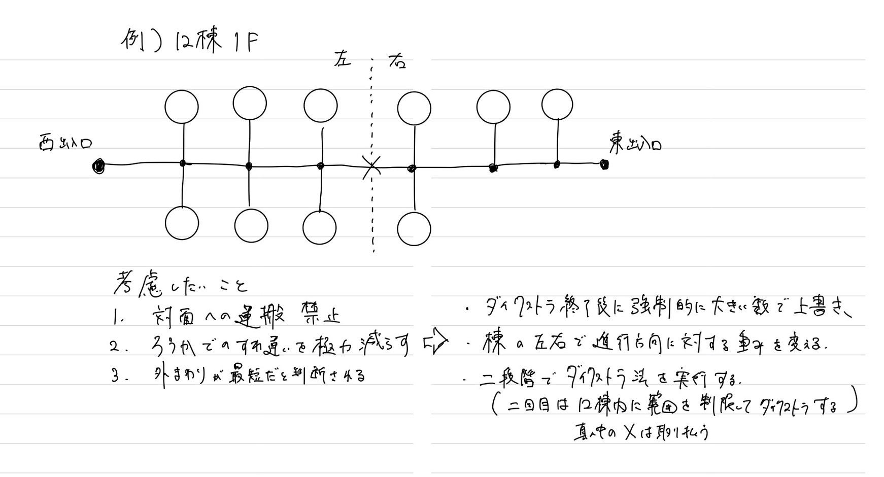

# タスク管理アプリ

## 概要

矢上祭準備日・片付け日に総務局が管理する机椅子移動タスクの計画＆運用を補助する Web アプリを作成する。

## デバッグとデプロイ

デバッグ（サーバ立ち上げ）
フロント：react-app/で npm run dev
バック：python-api/で uvicorn main:app --reload

デプロイ
フロント：/react-app で npm run deploy
バック：render サイトから manual deploy しかできない（github 監視して自動デプロイにもできると思う）

## 設計方針

このプロジェクトは主にタスク計画フェーズとタスク運用フェーズに分けて作成を行う。

### 1. タスク計画フェーズ

タスクの生成を行う。タスクは以下の形を１単位として定義した。

```
(1task) ＝ 地点S1から［地点D1へ備品O1をN1個，地点D2へ備品O2をN2個，...］
```

地点 S: 供給地 Supply、地点 D: 需要地 Demand、備品 O: 備品 Object、N: 個数  
タスク計画フェーズでは地点ごとの初期状態（マスタデータ）と目的状態の設定からタスク一覧を出力するところまでを目指す。

1. マスタ＆目的状態の個数編集

- XML 形式のファイルを受け取り読み取る。ファイルの中身は地点情報と経路情報、備品情報からなる（DATA ディレクトリ参照）。
- 地点情報と備品情報の編集をブラウザ上で行う。直感的な操作が望まれる。
- 編集された状態を再度 XML 形式に変換、ユーザーは出来上がった XML ファイルをダウンロードする。（名前を 「A.xml（仮）」とする ）

2. 最短経路決定と最適タスク一覧出力

- A.xml を入力ファイルとして受け取り読み取る（上と地続きでもいいかも）。
- ダイクストラ法※１にて最短経路を決定。適宜ダウンロード可能にしてもよい。
- 最短経路と地点情報をもとに線形計画法※２にて最適タスク一覧を決定。この時点でタスクの形は 地点 S から地点 D へ備品 O を N 個 のように出力される。
- 上で出力されたタスクを適切な単位タスクの形に整形する。この形のタスクをデータベース(firebase)の tasks に保存する。保存ごとにデータベース上のタスクが増えてしまうので、見分けがつくように eventId 的なものをそれぞれの試行に対して付与する。また、エクセル形式でダウンロード可能にもすべき。

---

※１※２のアルゴリズムについて  
**ダイクストラ法の詳細**


## 更新履歴

- 2025/08/02: リポジトリ立ち上げ
